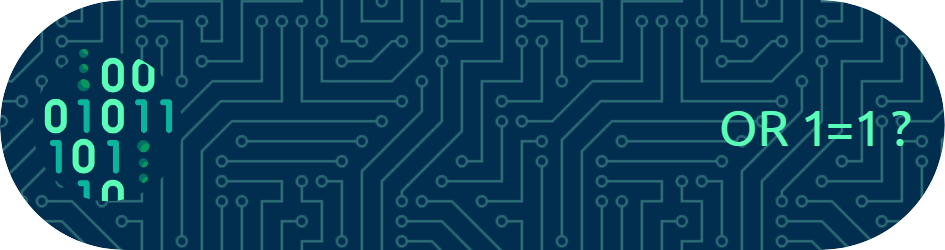

<h1 align="center">Hi 👋, I'm Angkon Dutta Joy</h1>
<h3 align="center">A passionate CSE student from Bangladesh</h3>

- 🔭 I’m currently working on **Diffusion models**

- 🌱 I’m currently learning **Data Analysis and BI tools**

- 📝 I regularly write articles on [https://dev.to/angkonduttajoy](https://dev.to/angkonduttajoy)

- 💬 Ask me about **Python**

- 📫 How to reach me **angkondutta@gmail.com**

<h3 align="left">Connect with me:</h3>

<h3 align="left">Languages and Tools:</h3>

                         

&nbsp;

